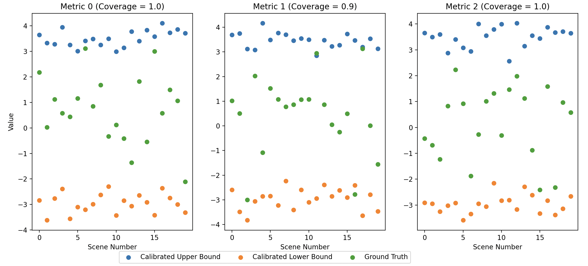

# Metric-guided Image Reconstruction Bounds via Conformal Prediction

This repository contains source code for our [paper](https://arxiv.org/abs/2404.15274).

## Abstract

Recent advancements in machine learning have led to the development of novel medical imaging systems and algorithms that address ill-posed problems. Assessing their trustworthiness and understanding how to deploy them safely at test time remains an important and open problem. In this work, we propose using conformal prediction to compute valid and distribution-free bounds on downstream metrics given reconstructions generated by one algorithm, and retrieve upper/lower bounds and inlier/outlier reconstructions according to the adjusted bounds. Our work offers 1) test time image reconstruction evaluation without ground truth, 2) downstream performance guarantees, 3) meaningful upper/lower bound reconstructions, and 4) meaningful statistical inliers/outlier reconstructions. We demonstrate our method on post-mastectomy radiotherapy planning using 3D breast CT reconstructions, and show 1) that metric-guided bounds have valid coverage for downstream metrics while conventional pixel-wise bounds do not and 2) anatomical differences of upper/lower bounds between metric-guided and pixel-wise methods. Our work paves way for more meaningful and trustworthy test-time evaluation of medical image reconstructions.

## Example Implementation
```python
from mg import MetricGuidedCalibration
import numpy as np

alpha = 0.2
method = 'CQR'
n_calib, n_test = 10000, 20
n_recons = 50
n_metrics = 3
metric_names = ['Metric ' + str(i) for i in range(n_metrics)]
c_yhats_dim = (n_calib, n_recons, n_metrics)
c_ys_dim = (n_calib, n_metrics)
t_yhats_dim = (n_test, n_recons, n_metrics)
t_ys_dim = (n_test, n_metrics)

# generate reconstructions corresponding to each test scene
# toy example
recons_test = np.random.rand(n_test, n_recons, 256, 256)

# get downstream metrics corresponding to each reconstruction
# toy example
c_yhats = np.random.normal(0.1, 1.2, c_yhats_dim)
c_ys = np.random.normal(0.5, 1.6, c_ys_dim)
t_yhats = np.random.normal(0.3, 1.5, t_yhats_dim)
t_ys = np.random.normal(0.4, 1.2, t_ys_dim)

# calibrate and test
cb = MetricGuidedCalibration(alpha=alpha, method=method)
cc_lb, cc_ub, cc_coverages = cb.fit(c_ys, c_yhats)
ct_lb, ct_ub, ct_coverages = cb.validate(t_ys, t_yhats)
n_metrics_each_sample, n_sample_all_metrics, inlier_bool, outlier_bool = cb.retrieve_in_out(t_yhats)
lb_vals, ub_vals = cb.retrieve_bounds(t_yhats)
lengths = cb.interval_lengths(ct_lb, ct_ub)
retreived_lengths = cb.retrieval_lengths(lb_vals, ub_vals)
ub_errs, lb_errs = cb.bound_errors(lb_vals, ub_vals)
print('Calibration Coverages: ', cc_coverages)
print('Test Coverages: ', ct_coverages)
print('Avg UB Retrieval Error: ', ub_errs.mean(0))
print('Avg LB Retrieval Error: ', lb_errs.mean(0))
```

## Running Example Code
```
python example.py

# Example Output:
# 	Calibration Coverages:  [0.8977 0.9013 0.9014]
# 	Test Coverages:  [1.  0.9 1. ]
# 	Avg UB Retrieval Error:  [-0.05486483 -0.00920602 -0.04949187]
# 	Avg LB Retrieval Error:  [0.03186384 0.02340578 0.00339853]
```



## Citation
```
@article{cheung2024metric,
  title={Metric-guided Image Reconstruction Bounds via Conformal Prediction},
  author={Cheung, Matt Y and Netherton, Tucker J and Court, Laurence E and Veeraraghavan, Ashok and Balakrishnan, Guha},
  journal={arXiv preprint arXiv:2404.15274},
  year={2024}
}
```