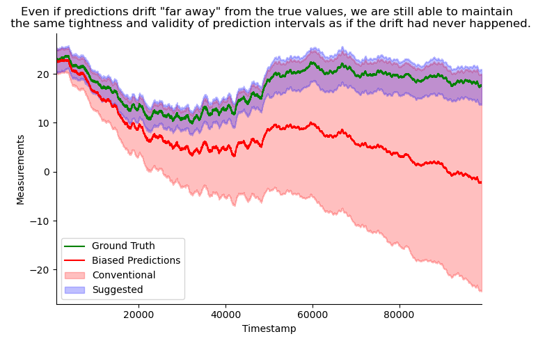

# Regression Conformal Prediction under Bias

This repository contains source code for our [paper]().

## Abstract

Uncertainty quantification is crucial to account for the imperfect predictions of machine learning algorithms for high-impact applications. Conformal prediction (CP) is a powerful framework for uncertainty quantification that generates calibrated prediction intervals with valid coverage. In this work, we study how CP intervals are affected by bias - the systematic deviation of a prediction from ground truth values - a phenomenon prevalent in many real-world applications. We investigate the influence of bias on interval lengths of two different types of adjustments -- symmetric adjustments, the conventional method where both sides of the interval are adjusted equally, and asymmetric adjustments, a more flexible method where the interval can be adjusted unequally in positive or negative directions. We present theoretical and empirical analyses characterizing how symmetric and asymmetric adjustments impact the "tightness" of CP intervals for regression tasks. Specifically for absolute residual and quantile-based non-conformity scores, we prove: 1) the upper bound of symmetrically adjusted interval lengths increases by 2|b| where b is a globally applied scalar value representing bias, 2) asymmetrically adjusted interval lengths are not affected by bias, and 3) conditions when asymmetrically adjusted interval lengths are guaranteed to be smaller than symmetric ones. Our analyses suggest that even if predictions exhibit significant drift from ground truth values, asymmetrically adjusted intervals are still able to maintain the same tightness and validity of intervals as if the drift had never happened, while symmetric ones significantly inflate the lengths. We demonstrate our theoretical results with two real-world prediction tasks: sparse-view computed tomography (CT) reconstruction and time-series weather forecasting. Our work paves the way for more bias-robust machine learning systems.

